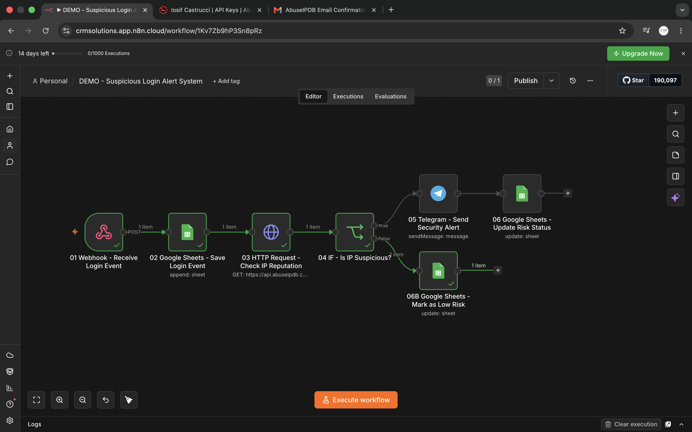
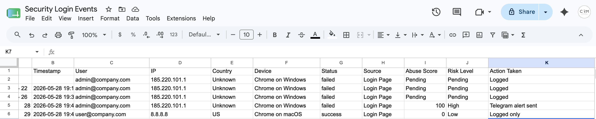

# Suspicious Login Alert System

A cybersecurity automation project built with **n8n**, **Google Sheets**, **Telegram**, and **AbuseIPDB**.

This project demonstrates how to build a simple security monitoring workflow that receives login events, checks the reputation of the login IP address, classifies the risk level, sends real-time alerts for suspicious activity, and logs all events inside a Google Sheets-based security register.

---






## Project Overview

The goal of this project is to create an automated suspicious login detection system.

The workflow receives a simulated login event through an n8n Webhook, stores it in Google Sheets, checks the IP reputation using AbuseIPDB, evaluates the risk level, sends a Telegram security alert when the IP is suspicious, and updates the event log with the final risk status.

This project is designed as a practical demo of **security automation**, **IP reputation checking**, **alerting**, and **incident logging**.

---

## Tech Stack

* **n8n Cloud** — workflow automation platform
* **Google Sheets** — security event log
* **Telegram Bot API** — real-time security alerts
* **AbuseIPDB API** — IP reputation checking
* **Webhook Trigger** — receives simulated login events
* **HTTP Request Node** — calls the AbuseIPDB API
* **IF Node** — evaluates if an IP is suspicious

---

## Main Features

### Login Event Collection

The workflow starts with a Webhook that receives login event data.

Example event fields:

* User
* IP address
* Country
* Device
* Login status
* Source

---

### Security Event Logging

Each login event is saved inside Google Sheets before the IP reputation check is completed.

The event is initially stored with:

```txt
Abuse Score = Pending
Risk Level = Pending
Action Taken = Logged
```

This creates a complete audit trail of all received login events.

---

### IP Reputation Check

The workflow uses the AbuseIPDB API to check the reputation of the IP address.

The main value used for risk classification is:

```txt
abuseConfidenceScore
```

This score ranges from `0` to `100`.

A higher score indicates a higher probability that the IP address has been reported for abusive or malicious activity.

---

### Risk Classification

The workflow uses a simple risk rule:

```txt
abuseConfidenceScore >= 75 → High Risk
abuseConfidenceScore < 75  → Low Risk
```

This logic can be expanded later with more detailed risk levels.

Example future model:

```txt
0 - 24    → Low
25 - 74   → Medium
75 - 100  → High
```

---

### Telegram Security Alert

When an IP address is classified as high risk, the system sends a Telegram alert to the business owner or security operator.

Example alert:

```txt
🚨 Suspicious Login Alert

A potentially malicious login event was detected.

User: admin@company.com
IP: 185.220.101.1
Country: Unknown
Device: Chrome on Windows
Status: failed
Source: Login Page

Abuse Score: 100/100
Risk Level: High

Recommended action:
Review this login event immediately, verify the account activity, and consider blocking the IP or enforcing 2FA.
```

---

### Low-Risk Event Handling

If the IP address is not considered high risk, the workflow does not send a Telegram alert.

Instead, it updates the Google Sheet with:

```txt
Risk Level = Low
Action Taken = Logged only
Notes = IP checked with AbuseIPDB, no high-risk reputation detected
```

This keeps the event log complete without creating unnecessary alerts.

---

## Workflow Structure

The workflow contains six main nodes plus an additional low-risk branch.

---

## Main Nodes

```txt
01 Webhook - Receive Login Event
02 Google Sheets - Save Login Event
03 HTTP Request - Check IP Reputation
04 IF - Is IP Suspicious?
05 Telegram - Send Security Alert
06 Google Sheets - Update Risk Status
06B Google Sheets - Mark as Low Risk
```

---

## Workflow Flow

```txt
01 Webhook - Receive Login Event
↓
02 Google Sheets - Save Login Event
↓
03 HTTP Request - Check IP Reputation
↓
04 IF - Is IP Suspicious?
   ├── true
   │   ↓
   │   05 Telegram - Send Security Alert
   │   ↓
   │   06 Google Sheets - Update Risk Status
   │
   └── false
       ↓
       06B Google Sheets - Mark as Low Risk
```

---

## Node Details

### 01 Webhook - Receive Login Event

This node receives a login event through a `POST` request.

Webhook configuration:

```txt
HTTP Method: POST
Path: login-event
Authentication: None
Respond: Immediately
```

The webhook expects a JSON payload containing login event details.

---

### 02 Google Sheets - Save Login Event

This node saves the login event inside Google Sheets.

Initial values:

```txt
Event ID: {{ $execution.id }}
Timestamp: {{ $now.format('yyyy-MM-dd HH:mm:ss') }}
User: {{ $('01 Webhook - Receive Login Event').item.json.body.user }}
IP: {{ $('01 Webhook - Receive Login Event').item.json.body.ip }}
Country: {{ $('01 Webhook - Receive Login Event').item.json.body.country }}
Device: {{ $('01 Webhook - Receive Login Event').item.json.body.device }}
Status: {{ $('01 Webhook - Receive Login Event').item.json.body.status }}
Source: {{ $('01 Webhook - Receive Login Event').item.json.body.source }}
Abuse Score: Pending
Risk Level: Pending
Action Taken: Logged
Notes:
```

---

### 03 HTTP Request - Check IP Reputation

This node sends the IP address to AbuseIPDB.

Configuration:

```txt
Method: GET
URL: https://api.abuseipdb.com/api/v2/check
Response Format: JSON
```

Query parameters:

```txt
ipAddress: {{ $json.IP }}
maxAgeInDays: 90
```

Headers:

```txt
Key: YOUR_ABUSEIPDB_API_KEY
Accept: application/json
```

Important: never expose the AbuseIPDB API key publicly or commit it to GitHub.

---

### 04 IF - Is IP Suspicious?

This node checks if the AbuseIPDB score is high enough to trigger an alert.

Condition:

```txt
{{ $json.data.abuseConfidenceScore }} >= 75
```

If true, the workflow sends a Telegram alert.

If false, the workflow marks the event as low risk.

---

### 05 Telegram - Send Security Alert

This node sends a Telegram alert when a suspicious IP is detected.

Message template:

```txt
🚨 Suspicious Login Alert

A potentially malicious login event was detected.

User: {{ $('01 Webhook - Receive Login Event').item.json.body.user }}
IP: {{ $('01 Webhook - Receive Login Event').item.json.body.ip }}
Country: {{ $('01 Webhook - Receive Login Event').item.json.body.country }}
Device: {{ $('01 Webhook - Receive Login Event').item.json.body.device }}
Status: {{ $('01 Webhook - Receive Login Event').item.json.body.status }}
Source: {{ $('01 Webhook - Receive Login Event').item.json.body.source }}

Abuse Score: {{ $('03 HTTP Request - Check IP Reputation').item.json.data.abuseConfidenceScore }}/100
Risk Level: High

Recommended action:
Review this login event immediately, verify the account activity, and consider blocking the IP or enforcing 2FA.
```

---

### 06 Google Sheets - Update Risk Status

This node updates the Google Sheet row when the IP is classified as high risk.

Column to match:

```txt
Event ID
```

Match value:

```txt
{{ $execution.id }}
```

Updated values:

```txt
Abuse Score: {{ $('03 HTTP Request - Check IP Reputation').item.json.data.abuseConfidenceScore }}
Risk Level: High
Action Taken: Telegram alert sent
Notes: IP reputation checked with AbuseIPDB
```

---

### 06B Google Sheets - Mark as Low Risk

This node updates the Google Sheet row when the IP is not considered high risk.

Column to match:

```txt
Event ID
```

Match value:

```txt
{{ $execution.id }}
```

Updated values:

```txt
Abuse Score: {{ $('03 HTTP Request - Check IP Reputation').item.json.data.abuseConfidenceScore }}
Risk Level: Low
Action Taken: Logged only
Notes: IP checked with AbuseIPDB, no high-risk reputation detected
```

---

## Google Sheets Structure

The Google Sheet is named:

```txt
Security Login Events
```

The worksheet/tab is named:

```txt
Events
```

Columns:

```txt
Event ID
Timestamp
User
IP
Country
Device
Status
Source
Abuse Score
Risk Level
Action Taken
Notes
```

Example row:

| Event ID | Timestamp           | User                                          | IP            | Country | Device            | Status | Source     | Abuse Score | Risk Level | Action Taken        | Notes                                |
| -------- | ------------------- | --------------------------------------------- | ------------- | ------- | ----------------- | ------ | ---------- | ----------- | ---------- | ------------------- | ------------------------------------ |
| 22       | 2026-05-28 18:40:00 | [admin@company.com](mailto:admin@company.com) | 185.220.101.1 | Unknown | Chrome on Windows | failed | Login Page | 100         | High       | Telegram alert sent | IP reputation checked with AbuseIPDB |

---

## Webhook Payload Examples

### High-Risk Login Event

Use this payload to test the high-risk branch.

```json
{
  "user": "admin@company.com",
  "ip": "185.220.101.1",
  "country": "Unknown",
  "device": "Chrome on Windows",
  "status": "failed",
  "source": "Login Page"
}
```

---

### Low-Risk Login Event

Use this payload to test the low-risk branch.

```json
{
  "user": "user@company.com",
  "ip": "8.8.8.8",
  "country": "US",
  "device": "Chrome on macOS",
  "status": "success",
  "source": "Login Page"
}
```

---

## cURL Test Examples

### High-Risk Test

Replace the URL with your own n8n test webhook URL.

```bash
curl -X POST "https://YOUR-N8N-DOMAIN.app.n8n.cloud/webhook-test/login-event" \
-H "Content-Type: application/json" \
-d '{
  "user": "admin@company.com",
  "ip": "185.220.101.1",
  "country": "Unknown",
  "device": "Chrome on Windows",
  "status": "failed",
  "source": "Login Page"
}'
```

Expected result:

```txt
Webhook receives the event
↓
Google Sheets saves the event
↓
AbuseIPDB checks the IP
↓
IF branch returns true
↓
Telegram security alert is sent
↓
Google Sheets updates the event as High Risk
```

---

### Low-Risk Test

Replace the URL with your own n8n test webhook URL.

```bash
curl -X POST "https://YOUR-N8N-DOMAIN.app.n8n.cloud/webhook-test/login-event" \
-H "Content-Type: application/json" \
-d '{
  "user": "user@company.com",
  "ip": "8.8.8.8",
  "country": "US",
  "device": "Chrome on macOS",
  "status": "success",
  "source": "Login Page"
}'
```

Expected result:

```txt
Webhook receives the event
↓
Google Sheets saves the event
↓
AbuseIPDB checks the IP
↓
IF branch returns false
↓
No Telegram alert is sent
↓
Google Sheets updates the event as Low Risk
```

---

## AbuseIPDB Response Field Used

The workflow mainly uses this field from the AbuseIPDB API response:

```txt
data.abuseConfidenceScore
```

Example:

```json
{
  "data": {
    "ipAddress": "185.220.101.1",
    "abuseConfidenceScore": 100,
    "countryCode": "DE",
    "usageType": "Data Center/Web Hosting/Transit",
    "isp": "Example ISP",
    "domain": "example.net"
  }
}
```

---

## Business and Security Value

This project shows how automation can support a basic security monitoring process.

It helps detect potentially suspicious login activity by:

* collecting login events
* checking IP reputation
* identifying high-risk IP addresses
* sending real-time alerts
* logging all security events
* reducing manual monitoring work
* improving response time

This type of workflow can be useful for:

* small businesses
* freelancers managing client systems
* internal admin panels
* website login monitoring
* early-stage SOC automation demos
* cybersecurity portfolio projects

---

## Possible Real-World Use Cases

This workflow can be adapted to monitor:

* failed admin login attempts
* suspicious WordPress logins
* SaaS login events
* VPN login activity
* internal dashboard access
* Cloudflare security events
* authentication logs from custom applications
* login events from external identity providers

---

## Future Improvements

Possible upgrades:

* Medium risk classification
* Multiple failed login detection
* Geo-location mismatch detection
* Country-based allowlist or blocklist
* Device fingerprinting
* User risk scoring
* Automatic IP blocklist update
* Slack or Microsoft Teams alerts
* Jira or Trello incident ticket creation
* Email alert to security team
* Daily security summary report
* Dashboard with event statistics
* AI-generated incident summary
* Error handling for API failures
* Secure webhook authentication
* Environment variables for API keys
* Separate workflows for production and testing

---

## Security Notes

Before using this in a real production environment, review the following:

* Protect the Webhook with authentication or a secret token.
* Do not expose API keys in screenshots or GitHub commits.
* Validate incoming event payloads.
* Avoid storing sensitive personal data unnecessarily.
* Review Google Sheets permissions.
* Use separate credentials for client projects.
* Monitor AbuseIPDB API rate limits.
* Add error handling for failed API requests.
* Avoid using public test URLs in production.
* Store logs according to privacy and compliance requirements.

---

## Project Status

Current version: working demo

Implemented:

* Webhook login event receiver
* Google Sheets event logging
* AbuseIPDB IP reputation check
* High-risk IP detection
* Telegram security alert
* High-risk event update
* Low-risk event update

---

## Author

Built by **Iosif Castrucci**

GitHub: `iosif castrucci`
Email: `contact.iosifcastrucci@gmail.com`

---

## Disclaimer

This project is a demo security automation workflow created for portfolio and educational purposes.

It is not a complete security monitoring platform and should not be used as the only method for detecting malicious activity in production systems.

For production use, add proper authentication, validation, logging, alert escalation, error handling, and security review.

---

## License

This repository is intended for portfolio and educational purposes.
You may adapt the workflow structure for your own projects.
